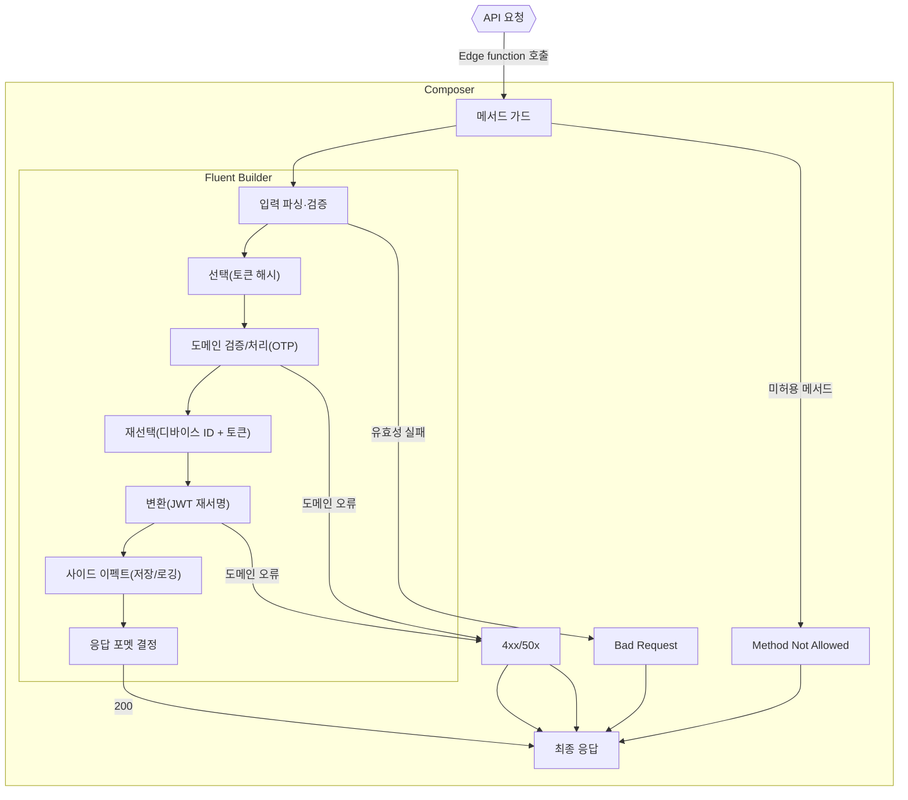

## 아키텍처 개요

공용 모듈을 기반으로 도메인 기능을 체인(Fluent Builder)과 미들웨어로 합성해 `Edge Function` 을 구성합니다.

### 디렉토리 구조 개요

```text
supabase/functions/
  _modules/
    shared/                          # 공용 모듈(프레임워크·경계·상태·보안·인프라)
      core/                          # 실행 프레임워크: 체인 빌더/컴포저 등
      adapters/                      # 경계 어댑터(프로토콜별)
        http/                        # HTTP 경계: 요청 파이프라인/에러/파싱
          middlewares/               # 메서드 가드·파이프라인 제어·입력 파서
          error/                     # 예외 → 표준 HTTP 에러 응답 매핑
          steps/                     # HTTP 페이로드 → 내부 모델 변환 단계
        websocket/                   # WebSocket 경계(확장 지점)
        webhook/                     # Webhook 경계(확장 지점)
      state/                         # 요청 컨텍스트/공용 입력 상태
        selectors/                   # 공용 읽기 전용 셀렉터
      security/                      # 보안 포트/타입(JWT 등, 인터페이스만)
        jwt/
      types/                         # 공용 타입 모음
      infra/                         # 외부 시스템 클라이언트(DI로 주입되는 구현)
      utils/                         # 범용 유틸리티(타입·작업 헬퍼 등)

  [edge_function_name]/              # 비즈니스 함수
    validators/                      # 입력 검증 스키마/파서(zod 등)
    state/                           # 함수 단위 컨텍스트 공유 상태/헬퍼
      selectors/                     # 공유 상태 읽기 전용 셀렉터
    adapters/                        # 함수 외부 의존 어댑터/팩토리
      jwt/                           # JWT 의존성 팩토리/바인딩
    steps/                           # 체인에서 사용하는 세부 단계 모음
      rules/                         # 컨텍스트 재선택/검증 규칙
      services/                      # 외부 연동/도메인 서비스 호출
      effects/                       # 사이드 이펙트(상태 저장/로깅 등) 처리 step
    usecases/                        # 비즈니스 로직 처리 흐름 정의 및 오케스트레이션
```

### 설계 원칙

- **입력 중앙화**: 파싱, 검증은 앞단 스텝/미들웨어 한 곳에서 처리
- **상태 캡슐화**: 쓰기는 헬퍼로 제한, 읽기는 셀렉터로만
- **합성 우선**: 단계별 로직을 작은 `Step` 단위로 쪼개어 체인(Fluent Builder)으로 합성
- **즉시 종료(Short-circuit) 일관성**: 어디서든 `ctx.response` 설정 시 즉시 반환, 예외는 공통 포맷
- **타입 안전한 합성**: `Step<In, Out, Body, State>` 제네릭으로 단계 간 타입 연결을 컴파일 타임에 보장. `tap`은 부수효과만 허용해 변환 오용 방지
- **테스트 용이성**: Step/Selector는 순수 함수로 유지하고, 외부 의존성은 DI로 주입. Entry/Middleware는 얇게 유지해 단위 테스트 범위 명확화
- **응답 일관성**: `HttpException.*`로 표준 에러 바디와 상태코드 통일. 오류 지점에서 즉시 종료하여 실패 경로를 단순화
- **관찰 가능성**: 공통 컴포저에서 로깅/메트릭 훅을 확보. 요청 단위 상관관계 ID(header) 전파 권장
- **확장 용이성**: 새 기능은 `validators/steps/effects/state/chains` 추가만으로 확장(Open-Closed). 네이밍 규약으로 역할 명확화
- **경계 분리**: 교차 관심사(인증/레이트리밋/트랜잭션)는 Middleware, 도메인 변환은 Step에 배치
- **실패 전략**: 외부 호출 Step에는 타임아웃/재시도/백오프 가이드를 적용하고, 필요 시 idempotency-key로 재실행 안전성 확보

### 객체 역할

- **State**: Request 수명주기 동안 공유되는 컨텍스트 저장소

  - Request Input(headers, query, body) 보관
  - 도메인별 상태 제공(예: `auth_data`)
  - 쓰기: State 헬퍼로만, 읽기: 셀렉터로만
  - 도메인 확장 규칙: 기능별 `FunctionState<T>`에 unique symbol 슬롯을 정의하고, 해당 슬롯에 대한 `State.setXxx/getXxx` 헬퍼로만 쓰기를 허용

- **Selector**: `State`에 대한 읽기 전용 접근자(검증·형변환 캡슐화)

  - 실패 시 예외를 통해 즉시 종료(Short-circuit)
  - 예: `selectRequestBodyStep`, 토큰 해시/디바이스 ID 선택

- **Step**: 체인에서 합성되는 순수 도메인 로직 유닛

  - 시그니처: `Step<In, Out, Body, State>`
  - 예: `parseInputStep`, `verifyOtp`, `resignJwtWithDeviceId`

- **Middleware**: `compose`로 실행되는 Request 처리 유닛(응답 설정 시 즉시 종료)

  - 예: `methodGuard(["POST"])`, `chain(...).toMiddleware()`
  - 입력 파싱은 Step 또는 Middleware 중 하나로 일관 적용
  - 책임 분리: Middleware는 요청의 큰 흐름(예: 메서드 가드/인증/트랜잭션 경계)을 표현, 세부 도메인 변환은 Step이 담당

- **Compose**

  - 미들웨어 순차 실행, `ctx.response` 감지 시 즉시 반환
  - 예외를 `HttpException.internalError`로 변환

- **ChainBuilder (Fluent)**: 단계 합성을 선언적으로 표현하는 빌더. 긴 제네릭 함수 합성 대비 타입 전파 안정성과 에디터 성능(지연) 개선을 위해 적용

  - then: Acc를 다음 단계 입력으로 전달(동기/비동기 지원)
  - tap: 값을 유지한 채 부수효과만 수행
  - reselect: 이전 값을 버리고 컨텍스트에서 새 값을 선택
  - toMiddleware: 체인을 미들웨어로 변환해 compose에 연결

- **Validator**: 입력값 구조/형식/제약 검증 담당(실패 시 즉시 종료)

  - `zod` 스키마 기반 입력 검증
  - zod 외 커스텀 파서도 동일 시그니처로 교체 가능

- **Error**: `HttpException.*`로 표준 JSON 에러 응답 생성; compose/chain에서 예외 포착 시 응답이 없으면 적절한 에러로 변환하고, 설정된 응답이 있으면 즉시 종료(Short-circuit)(일관된 상태코드/메시지, `details` 지원)

### 요청 흐름 예시(`signup`)

1. 메서드 가드: 허용되지 않은 메서드는 즉시 종료(Short-circuit)
2. 입력 파싱·검증: 요청 바디를 구조화하고 유효성 검사 수행
3. 선택: 컨텍스트에서 필요한 값 선택(예: 토큰 해시)
4. 도메인 검증/처리: 외부 시스템과 상호작용 포함(예: OTP 검증)
5. 재선택: 컨텍스트 기반으로 다음 단계 입력 구성(예: 디바이스 ID + 토큰)
6. 변환: 도메인 결과 생성/변환(예: JWT 재서명)
7. 사이드 이펙트: 결과 저장·로깅 등(값은 변경하지 않음)
8. 최종 응답: 상태에서 결과를 읽어 응답 생성



### 구현 가이드

- 입력 파싱 일관성

  - Step(`parseInputStep`) 또는 Middleware 중 하나를 선택해 일관되게 적용

- 사이드 이펙트 규칙

  - `tap((value, ctx) => Promise<void> | void)`만 허용(값 변환 금지)
  - 변환이 필요하면 반드시 `then(step)`으로 입력/출력 타입 체인을 유지

- 네이밍 & 배치

  - 변환: `*.step.ts`, 부수효과: `*.effect.ts`
  - 체인 정의는 `feature/chains/`에 배치하여 유즈케이스를 한눈에 파악

- 에러 처리 정책
  - 도메인 오류 발생 시 필요한 경우 `ctx.response`를 설정해 즉시 종료(Short-circuit)
  - 미처리 예외는 compose/chain에서 표준 에러 응답(`HttpException.*`)으로 변환
